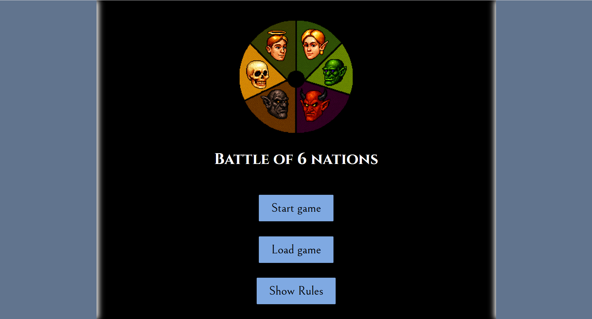
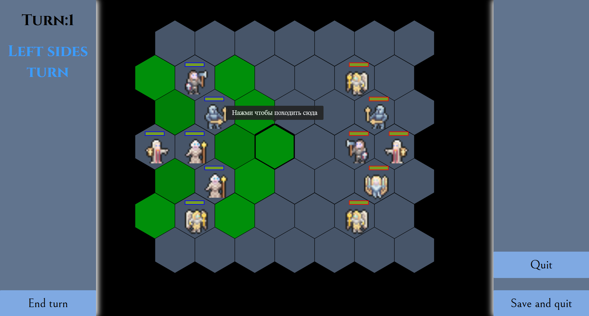
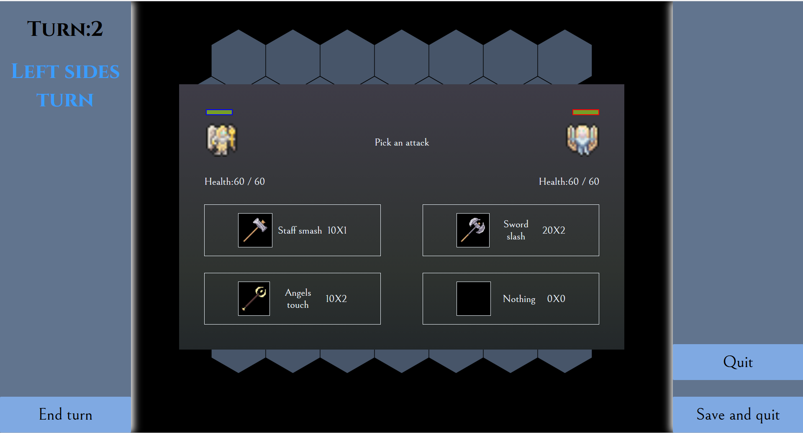

# Tactical Game Frontend

Frontend for a turn-based tactical game (Battle Of 6 Nations).  
React + TypeScript, API integration, polling, custom UI components.

## Tech Details

**Architecture:**
- Service layer (`/API/`) for API logic encapsulation
- Centralized endpoints (`/API/API.ts`)
- Polling implementation in `UnitService` for state updates
- `AudioPlayer.ts` module for HTML5 Audio management

**Code:**
- TypeScript in core modules (services, types, components)
- Custom components: `MyButton`, `MySelect`, `Column`
- CSS Modules per component (scoped styles)
- React tooltips

**Stack:**
- React (functional components + hooks)
- TypeScript
- CSS Modules

## Screenshots

---
